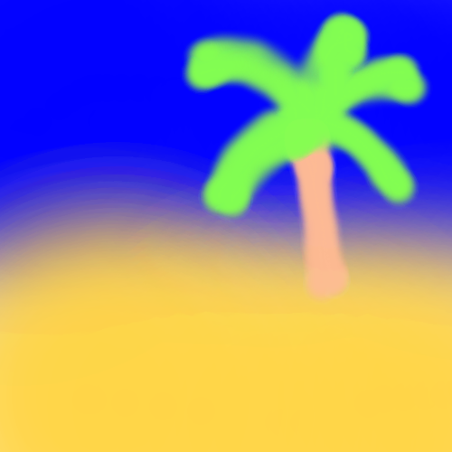
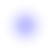
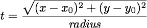
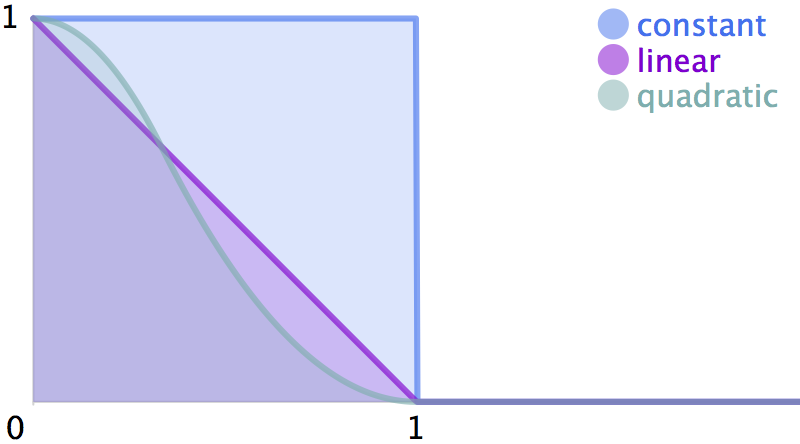
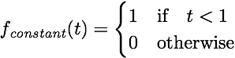
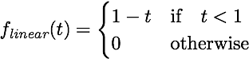
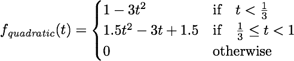

Computer Graphics - Homework Assignment 1 - Airbrush
====================================================

Overview:
---------

In this assignment, you will be implementing a digital painting tool
similar to the airbrush in Photoshop (and better than the painting tools
in MS Paint). You will be able to create stunning artwork like
this:

Although it looks fancy, it's pretty simple if we break it down into two
parts: (1) creating a translucent RGBA image for a spray of the airbrush
and (2) depositing the paint by compositing the airbrush RGBA image onto
the background image centered at the mouse location.

Goals:
------

* Understand raster images and simple compositing.

* Become familiar with C++.

* Successfully install a C++ development environment.

Background:
-------

* Book (FoCG,4e): Chapter 3: Raster Images
* Video: "Lecture 2: Raster Graphics" and "Assignment 1: Airbrush"
* Worksheet: Airbrush

(FoCG,4e is *Fundamentals of Computer Graphics (4th edition)* by Steve Marschner and Peter Shirley.)

Worksheet:
-------

Before you start programming, complete [this worksheet](docs/worksheet.pdf) with a friend.
See Piazza for instructions on turning it in. Once you do, we will share the answers.

Getting Started & Handing In:
-----------------------------

* Download or clone this code repository. Don't fork it on GitHub, or else your code will be visible to everyone.

* Follow the instructions to install a working development environment: <https://github.com/yig/graphics101>

* Build and run the code. The code should compile and run, but clicking
and dragging in the window won't have any effect.

* Add your code to `airbrush.cpp`.

    * Your code will be written in C++, but nothing fancy. It will look like a
    mix of C and Java.
    * The framework and libraries provide all the support code that you need. You will need to understand a few functions, described below.
    * The GUI code is written using the open source Dear ImGui GUI framework. Your code is isolated from this code. Feel free to enhance the interface if you so desire.

* Build and run and test that it is working correctly.

* Check your work with the command line tests by running `ctest --verbose`. This will test whether your airbrushes are created correctly (`create_airbrush()`) and whether your compositing (`paint_at()`) is working correctly. If either of these are not working, the GUI will not work as expected.

* Create a painting and save it in the `artwork` folder. You are encouraged but not required to share it with everyone on Piazza, too. You are also encouraged to share blooper images you create while implementing the assignment.

* Create a file named `Notes.txt` in the folder. Describe any known issues or extra features. Name people in the class who deserve a star for
helping you (not by giving your their code!).

* When done, run the the `cpack` command from inside your build directory
to generate an appropriate zip file of your `airbrush` project.
The zip file it creates, `airbrush.zip`, will include
the `artwork` subdirectory and your `Notes.txt` file.
It will ignore unneeded large and numerous directories
(e.g. `build`).
Upload your `airbrush.zip` before the deadline.
(If you can't use `cpack`, try `make zip` or `cmake --build . --target zip`)

* **THIS IS AN INDIVIDUAL, NOT A GROUP ASSIGNMENT. That means all code
written for this assignment should be original! Although you are
permitted to consult with each other while working on this assignment,
code that is substantially the same will be considered cheating.**

Rubric:
-------

1. **(50 points)** Creating a translucent RGBA image for a spray of the
airbrush. An airbrush is defined by its color, radius, and shape.
Here are some examples:

    * Shape: Quadratic  
    Radius: 25 pixels  
    Color: (0, 0, 255, 64) aka blue at 25% opacity  
    
    
    * Shape: Linear  
    Radius: 25 pixels  
    Color: (0, 0, 255, 64) aka blue at 25% opacity  
    

    * Shape: Constant  
    Radius: 25 pixels  
    Color: (0, 0, 255, 64) aka blue at 25% opacity  
    

    The algorithm to generate any of these airbrush images is very similar.
We are given an RGBA color, which means it has red, green, blue, and
alpha components. In our code, an RGBA color takes up 32-bits. Each component
will be stored as one of its four bytes. That means that each component will be
an 8-bit integer whose value lies in the range 0 to 255. It is sometimes
convenient to think of components as lying in the continuous range
[0,1], in which case you would divide the 8-bit component values by 255.
An airbrush image is a square RGBA image with dimensions
`2*radius+1` by `2*radius+1`. Each pixel has the same RGB values taken
directly from the color but varying A (alpha) or opacity. In the brushes
above, alpha is at its maximum at the center pixel and falls off to 0
for pixels whose distance is radius or greater from the center. The
brushes above differ only in how the opacity falls off. To compute the
opacity for a pixel, let's set a variable *t* to the distance from the
center pixel as a fraction of the radius:
    
    
    
    Then all we need is a *falloff* function of *t* to create interesting
circular shapes. With such a function, each airbrush image pixel's
alpha value is then conveniently expressed as the color's alpha * *f(t)*.
Note that the user-specified color has an alpha value.
We multiply it by the falloff function.

    * **(25 points)** Writing the code that iterates over every x,y pixel of
the brush image and sets its RGBA components appropriately. That
function signature is:

            void create_airbrush(
                Image& airbrush_out,
                AirBrushShape shape, int radius, ColorRGBA8 color
                )

        `Image` is a class that wraps an array of RGBA values with
convenience methods. The `&` is C++'s way of passing by reference (it's
like a dereferenced pointer in C). `AirBrushShape` is an `enum`. You will
assign every x,y pixel of the output parameter `airbrush_out`. x ranges
from 0 to `airbrush_out.width()` and y ranges from 0 to
`airbrush_out.height()`. You can assign pixels either by calling
`airbrush_out.pixel()` or, if you want to work closer to the metal, by
accessing the pointer to the array of pixels directly via
`airbrush_out.scanline()` (see below). To access the appropriate falloff function (the
ones you write, see below), call the helper function `falloff( shape, t )`.

    * **(25 points)** Implement *falloff* functions for the following three
shapes.

        

        * **(5 of the 25 points)** A constant function `falloff_constant()`. It just
makes a circle. (These equations are shown 3 ways because GitHub's Markdown processing doesn't handle equations well.)

            

        * **(10 of the 25 points)** A linear function `falloff_linear()`.
It makes a "cone".

            

        * **(10 of the 25 points)** A quadratic function `falloff_quadratic()` that
looks like a Gaussian (very aesthetically pleasing) but without an
infinite tail.

            

        * **(up to 5 bonus points)** A special function `falloff_special()` that does
anything you want!

2. **(50 points)** Depositing the paint by compositing the airbrush RGBA
image onto the background image centered at the mouse location. The
function signature for this is:

        Rect paint_at(
            Image& image_to_modify,
            const Image& airbrush_image,
            int center_x,
            int center_y
            )

    You will modify a subset of the pixels of the output parameter
`image_to_modify` by compositing the pixels of `airbrush_image` over
them. `airbrush_image` should be composited with its center at the
`center_x`, `center_y` pixel of `image_to_modify`. Note that depending
on the size of `airbrush_image` and the location of its center, only part
of it will fit on `image_to_modify`. Figuring out which pixels of
`airbrush_image` and `image_to_modify` to iterate over—without
accessing out-of-bounds memory—is the first step of this function.
You will return the rectangle corresponding to the pixels of `image_to_modify`
that you actually modified.

    * **(25 of the 50 points)** Correct iteration bounds. Note that you must
return the iteration bounds related to `image_to_modify` as a `Rect`.
This is so that the GUI knows which part of the window to redraw.

    * **(25 of the 50 points)** Compositing the corresponding RGBA pixel of
`airbrush_image` onto the RGB pixel of `image_to_modify`. To help you
with this, I have created a helper function signature (you fill it in):

            ColorRGBA8 composite( const ColorRGBA8& foreground, const ColorRGBA8& background );

        Recall from class or the textbook or Wikipedia that the formula to
composite a foreground color "over" a background color is:

        *C.red = (1 - F.alpha) * B.red + F.alpha * F.red*

        where *C* is the output composited pixel, *F* is the foreground pixel,
and *B* is the background pixel. The formula is the same for the green
and blue channels. In this formula, alpha values range from [0,1], not
[0,255], so don't forget to convert. (Note that if the background
image were also transparent, the formula would be slightly different.
You are not expected to handle that case.)
The formula `(1 - t)*a + t*b` appears so frequently in math and computer
science that it has a shorthand name: lerp, short for linear
interpolation. You may find it useful to fill in and use a helper
function. The signature is provided:

            int lerp( int a, int b, real t )

        `real` is a typedef for a floating point number. It is a requirement that
you fill in and make use of `composite()`. It is not a requirement that
you fill in and use `lerp()`.

    * **(5 bonus points)** Write composite (and lerp) without using floating
point numbers. Floating point operations have traditionally been slower than integer operations. You will have to modify the function signature for lerp to

            int lerp( int a, int b, int t )

        to accomplish this.

Support code functions you need for this assignment
-----------------------------------------

**Rect.** The constructor of `Rect` is `Rect( x, y, width, height )`.

**Image:**

* `image.pixel(x,y)` returns the `ColorRGBA8` color for pixel x,y of an `Image image`. The top left pixel is (0,0), not the bottom left.
* `image.pixel(x,y) = c` sets the pixel to a `ColorRGBA8` color `c`.

* `image.width()` and `image.height()` return the width and height of the
image.

* (Optional) `image.scanline(y)` returns a pointer to the array of `ColorRGBA8` pixel data for
row y. You do not need to do this but may wish to get closer to the metal for
performance (avoiding function calls) or the experience. If you wish to attempt this,
first make your code work using `.pixel()`.
The pointer returned by `image.scanline(y)` points to the pixel (0,y).
If you have a pointer to a pixel `ColorRGBA8* pix`, the next pixel in the row is `pix+1`
and the next pixel in the column is `pix+image.width()`.

`sqrt(x)`, `std::min(a,b)`, `std::max(a,b)`, `lround(x)`. These are part of C's `math.h`
(in C++ included as `<cmath>`)
and C++'s `<algorithm>`. You will find them useful.
Note that `std::min` and `std::max` require both
parameters to have the exact same type. If not, you will get a very long
compiler error since they are generic functions written using C++
templates.

**ColorRGBA8** To get the red, green, blue, and alpha components of a
`ColorRGBA8` color `c` as 8-bit values, use `c.r`, `c.g`, `c.b`, and `c.a`. To
create an RGB `ColorRGBA8` color, use `ColorRGBA8( red, green, blue )` with
8-bit parameters. Each of the parameters should be an integer number in the
range [0,255], inclusive. To create an RGBA `ColorRGBA8` color, use `ColorRGBA8(
red, green, blue, alpha )` with 8-bit parameters. Note that `ColorRGBA8` is a
4-byte struct; some packages instead use a `typedef` for an `unsigned int` and
then perform bitwise manipulation to store the appropriate bytes.
